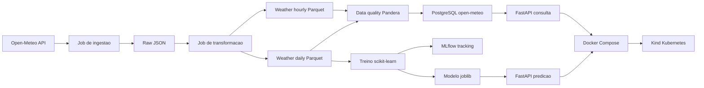

# dev-ops-open-meteo

[](https://github.com/Dluccas2001/dev-ops-open-meteo/actions/workflows/ci.yaml)
[](https://www.python.org/)
[](LICENSE)

Pipeline end-to-end de Engenharia de Dados, DevOps e MLOps usando dados
climaticos da API publica Open-Meteo.

> Status atual: ingestao, transformacao, data quality, carga PostgreSQL, API,
> treino MLflow, serving FastAPI, Docker Compose e manifests Kubernetes/Kind
> implementados. A evidencia real de deploy/rollback no Kind deve ser gerada no
> WSL onde o cluster foi criado.

## Objetivo

Este projeto demonstra um fluxo completo de dados e MLOps:

- ingestao de dados da Open-Meteo;
- persistencia raw em JSON;
- transformacao para datasets Parquet;
- checks de data quality com Pandera;
- carga em PostgreSQL dedicado;
- API FastAPI para consulta e predicao;
- treinamento scikit-learn com tracking MLflow;
- operacao local com Docker Compose;
- deploy local em Kubernetes com Kind;
- CI com lint, format, testes, build, scan e validacao de manifests.

## Arquitetura



Detalhes complementares ficam em [docs/architecture.md](docs/architecture.md).

## Requisitos

- Python 3.11 ou 3.12
- Git
- Docker Desktop com integracao WSL, ou Docker Engine
- Docker Compose
- kubectl
- Kind
- Trivy
- Make opcional

Veja o guia de ambiente em [docs/ambiente.md](docs/ambiente.md).

## Setup Local

No WSL, zsh ou Git Bash:

```bash
python3 -m venv .venv
source .venv/bin/activate
python -m pip install --upgrade pip
python -m pip install -r requirements-dev.txt
cp .env.example .env
```

No PowerShell:

```powershell
python -m venv .venv
.\.venv\Scripts\activate
python -m pip install --upgrade pip
python -m pip install -r requirements-dev.txt
Copy-Item .env.example .env
```

Para Compose, mantenha no `.env`:

```env
DB_HOST=postgres
DB_NAME=open-meteo
POSTGRES_DB=open-meteo
MLFLOW_TRACKING_URI=http://mlflow:5000
```

Para rodar Python direto na maquina, `DB_HOST` normalmente deve ser `localhost`.

## Validacao Local

```bash
python -m ruff check .
python -m ruff format --check .
python -m pytest
```

Resultado validado localmente:

```text
All checks passed!
22 passed
```

## Pipeline De Dados

Rodar etapas separadas:

```bash
python -m src.jobs.ingest
python -m src.jobs.transform
python -m src.quality.checks
python -m src.jobs.load
python -m src.ml.train
```

Ou via Make:

```bash
make pipeline
```

Saidas principais:

```text
data/raw/open_meteo/{cidade}/{YYYY-MM-DD}.json
data/processed/weather_hourly.parquet
data/processed/weather_daily.parquet
models/rain_model.joblib
models/model_info.json
```

Esses artefatos sao locais e ficam ignorados pelo Git.

## PostgreSQL

O projeto usa uma database dedicada chamada `open-meteo`, separada da database
padrao `postgres` para evitar conflito com outros projetos.

Tabelas carregadas:

```text
weather_hourly
weather_daily
```

O job `src.jobs.load` tenta criar a database automaticamente quando a conexao
PostgreSQL permite.

## API

Rodar localmente:

```bash
python -m uvicorn src.api.main:app --reload --host 0.0.0.0 --port 8000
```

Endpoints:

- `GET /health`
- `GET /metadata`
- `GET /cities`
- `GET /weather/latest?city=sao-paulo`
- `GET /weather/daily?city=sao-paulo&limit=30`
- `GET /weather/summary`
- `GET /model/info`
- `POST /predict/rain`

Exemplo de predicao:

```json
{
  "city": "sao-paulo",
  "temp_mean": 22.0,
  "temp_min": 18.0,
  "temp_max": 26.0,
  "humidity_mean": 75.0,
  "wind_mean": 9.0,
  "rain_sum": 0.0,
  "month": 7,
  "day_of_week": 0
}
```

## Docker Compose

Subir API, PostgreSQL e MLflow:

```bash
docker compose up -d --build
docker compose ps
```

Carregar dados e treinar modelo dentro do container da API:

```bash
docker compose exec -T api python -m src.jobs.load
docker compose exec -T api python -m src.ml.train
```

Acessos:

```text
API:    http://localhost:8000/docs
MLflow: http://localhost:5000
```

Parar:

```bash
docker compose down
```

## Kubernetes Com Kind

Validar manifests:

```bash
kubectl kustomize k8s
```

Criar cluster, buildar imagem e carregar no Kind:

```bash
kind create cluster --name weather-mlops
docker build -f ContainerFile -t weather-mlops-api:local .
kind load docker-image weather-mlops-api:local --name weather-mlops
```

Aplicar e verificar:

```bash
kubectl apply -k k8s
kubectl get all -n weather-mlops
kubectl rollout status deployment/weather-api -n weather-mlops
```

Acessar API:

```bash
kubectl port-forward -n weather-mlops service/weather-api 8000:8000
curl http://localhost:8000/health
```

Rollback:

```bash
kubectl rollout history deployment/weather-api -n weather-mlops
kubectl rollout undo deployment/weather-api -n weather-mlops
kubectl rollout status deployment/weather-api -n weather-mlops
```

Equivalentes no Makefile:

```bash
make validate-k8s
make kind-create
make deploy
make status
make rollback
```

## CI/CD

O workflow em `.github/workflows/ci.yaml` executa:

- checkout;
- setup Python;
- instalacao de dependencias;
- Ruff lint;
- Ruff format check;
- Pytest;
- transformacao e data quality sobre fixtures versionadas;
- build da imagem;
- scan Trivy em modo filesystem;
- validacao dos manifests Kubernetes.

## Evidencias

As evidencias textuais ficam em [docs/evidences](docs/evidences):

- [testes automatizados](docs/evidences/tests.md)
- [data quality](docs/evidences/data-quality.md)
- [Docker Compose](docs/evidences/compose.md)
- [carga PostgreSQL](docs/evidences/postgres-load.md)
- [MLflow tracking](docs/evidences/mlflow-tracking.md)
- [API de predicao](docs/evidences/api-predict.md)
- [Kind deploy](docs/evidences/kind-deploy.md)
- [Kind rollback](docs/evidences/kind-rollback.md)

## Troubleshooting

Problemas conhecidos e solucoes estao em
[docs/troubleshooting.md](docs/troubleshooting.md).

## Decisoes Tecnicas

As decisoes de arquitetura ficam registradas como ADRs em [docs/adr](docs/adr).

ADRs atuais:

- `0001-open-meteo-como-fonte-de-dados.md`
- `0002-arquitetura-raw-processed-e-postgres.md`
- `0003-pandera-para-data-quality.md`
- `0004-mlflow-e-kind-para-mlops-e-operacao-local.md`
- `0005-job-sincrono-para-ingestao-open-meteo.md`
- `0006-fixtures-versionadas-para-transformacao-e-qualidade.md`
- `0007-database-dedicada-open-meteo.md`
- `0008-modelo-local-com-mlflow-e-serving-fastapi.md`
- `0009-kind-para-deploy-local-da-api.md`

## Plano

O plano de implementacao esta em
[PLANO_IMPLEMENTACAO.md](PLANO_IMPLEMENTAÇÃO.md).
