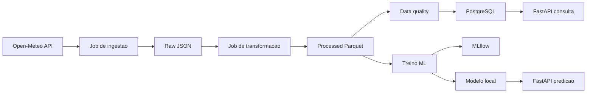

# dev-ops-open-meteo

[](https://github.com/Dluccas2001/dev-ops-open-meteo/actions/workflows/ci.yaml)
[](https://www.python.org/)
[](LICENSE)

Pipeline de dados climaticos com DevOps e MLOps usando a API publica Open-Meteo.

> Status atual: ingestao implementada, transformacao e data quality em andamento,
> com testes automatizados usando fixtures locais.

## Objetivo

Este projeto demonstra um fluxo completo de Engenharia de Dados e MLOps:

- ingestao de dados da Open-Meteo;
- persistencia em camada raw;
- transformacao para datasets processados;
- data quality;
- carga em PostgreSQL;
- API FastAPI;
- treinamento e tracking com MLflow;
- serving de modelo;
- CI/CD;
- operacao local em Kubernetes com Kind.

## Arquitetura



## Status

Fase atual: **Fase 3 - Transformacao e qualidade**.

Ja configurado:

- estrutura inicial de pastas;
- ambiente Python com dependencias;
- FastAPI minima;
- endpoints `/health` e `/metadata`;
- testes unitarios iniciais e testes de pipeline com fixtures;
- Ruff para lint/format;
- Compose preparado para API, PostgreSQL e MLflow;
- CI inicial no GitHub Actions;
- ADRs iniciais em `docs/adr/`;
- plano completo em `PLANO_IMPLEMENTAÇÃO.md`.

## Requisitos

- Python 3.11 ou 3.12
- Git
- Docker ou Podman
- Docker Compose ou Podman Compose
- Make ou PowerShell
- kubectl
- Kind
- Trivy

Para a primeira fase, apenas Python e Git ja permitem rodar a API e os testes. Docker, kubectl, Kind e Trivy entram nas proximas fases.

Veja detalhes em [docs/ambiente.md](docs/ambiente.md).

## Setup Local Com zsh, WSL Ou Git Bash

Em ambientes Linux-like, o comando pode ser `python3` antes do ambiente virtual existir.

Entre na pasta do projeto:

```bash
cd "/mnt/h/Projetos/DevOps e MLOps/dev-ops-open-meteo"
```

Verifique a versao:

```bash
python3 --version
```

Crie e ative o ambiente virtual:

```bash
python3 -m venv .venv
source .venv/bin/activate
```

Depois que o `.venv` estiver ativo, use `python` normalmente:

```bash
python -m pip install --upgrade pip
python -m pip install -r requirements-dev.txt
```

Crie o arquivo de configuracao local:

```bash
cp .env.example .env
```

## Setup Local Com PowerShell

```powershell
python -m venv .venv
.\.venv\Scripts\activate
python -m pip install --upgrade pip
python -m pip install -r requirements-dev.txt
Copy-Item .env.example .env
```

Se a execucao de scripts PowerShell estiver bloqueada, voce pode usar os comandos Python acima diretamente. O script auxiliar tambem existe:

```powershell
powershell -ExecutionPolicy Bypass -File scripts\dev.ps1 setup
```

## Validar Instalacao

Com o `.venv` ativo, rode:

```bash
python -m ruff check .
python -m pytest
```

Resultado esperado:

```text
All checks passed!
2 passed
```

## Rodar API Local

Com o `.venv` ativo:

```bash
python -m uvicorn src.api.main:app --reload --host 0.0.0.0 --port 8000
```

Acesse:

```text
http://localhost:8000/docs
http://localhost:8000/health
http://localhost:8000/metadata
```

Observacao: `GET /` ainda retorna `404 Not Found`, porque a raiz da API ainda nao foi implementada. Por enquanto os endpoints validos sao `/health`, `/metadata` e `/docs`.

Para parar a API:

```text
Ctrl + C
```

## Comandos Uteis

```bash
python -m ruff check .
python -m ruff format --check .
python -m ruff check . --fix
python -m pytest
python -m uvicorn src.api.main:app --reload --host 0.0.0.0 --port 8000
python -m src.jobs.ingest
python -m src.jobs.transform
python -m src.quality.checks
python -m src.jobs.load
python -m src.ml.train
```

Com Make instalado, os equivalentes serao:

```bash
make lint
make format
make test
make run-api
make ingest
make transform
make quality
make load
make train
```

Enquanto `make` nao estiver disponivel no Windows, use os comandos `python -m ...`.

## Docker E Servicos Locais

O arquivo `compose.yaml` ja esta preparado para subir:

- `api`;
- `postgres`;
- `mlflow`.

Quando Docker Desktop ou Podman estiver instalado:

```bash
docker compose up -d --build
docker compose down
```

## Pipeline De Dados

### Ingestao

O job de ingestao le as cidades em `config/cities.yaml`, chama a API
Open-Meteo e salva uma resposta raw por cidade e data:

```bash
python -m src.jobs.ingest
```

Saida esperada:

```text
data/raw/open_meteo/{cidade}/{YYYY-MM-DD}.json
```

### Transformacao

O job de transformacao le os JSONs raw e gera dois datasets processados:

```bash
python -m src.jobs.transform
```

Saidas:

```text
data/processed/weather_hourly.parquet
data/processed/weather_daily.parquet
```

### Data Quality

Os checks de qualidade validam colunas obrigatorias, intervalos plausiveis,
unicidade por cidade/tempo e consistencia das agregacoes diarias:

```bash
python -m src.quality.checks
```

No CI, esses checks rodam sobre uma fixture versionada em `data/samples` para nao
depender de internet.

### Carga PostgreSQL

O projeto usa uma database dedicada chamada `open-meteo`, separada da database
padrao `postgres` e de outros projetos locais.

```bash
python -m src.jobs.load
```

Tabelas carregadas:

```text
weather_hourly
weather_daily
```

Se a `DATABASE_URL` apontar para PostgreSQL, o job tenta criar a database
`open-meteo` automaticamente antes da carga.

## API De Consulta

Endpoints atuais:

- `GET /health`
- `GET /metadata`
- `GET /cities`
- `GET /weather/latest?city=sao-paulo`
- `GET /weather/daily?city=sao-paulo&limit=30`
- `GET /weather/summary`
- `GET /model/info`
- `POST /predict/rain`

Exemplo de payload para predicao:

```json
{
  "city": "sao-paulo",
  "temp_mean": 22.0,
  "temp_min": 18.0,
  "temp_max": 26.0,
  "humidity_mean": 75.0,
  "wind_mean": 9.0,
  "rain_sum": 0.0,
  "month": 7,
  "day_of_week": 0
}
```

## MLOps

O treino cria o target `will_rain_tomorrow` a partir da chuva do dia seguinte,
treina um modelo scikit-learn e registra metricas no MLflow:

```bash
python -m src.ml.train
```

Artefatos locais:

```text
models/rain_model.joblib
models/model_info.json
```

Se o servidor MLflow configurado nao estiver disponivel, o treino registra o run
em `file:mlruns` para manter a execucao local funcionando.

## Decisoes Tecnicas

As decisoes de arquitetura ficam registradas como ADRs em `docs/adr/`.

ADRs atuais:

- `0001-open-meteo-como-fonte-de-dados.md`
- `0002-arquitetura-raw-processed-e-postgres.md`
- `0003-pandera-para-data-quality.md`
- `0004-mlflow-e-kind-para-mlops-e-operacao-local.md`
- `0005-job-sincrono-para-ingestao-open-meteo.md`
- `0006-fixtures-versionadas-para-transformacao-e-qualidade.md`
- `0007-database-dedicada-open-meteo.md`
- `0008-modelo-local-com-mlflow-e-serving-fastapi.md`

## Proximas Ferramentas A Instalar

Para as fases seguintes:

```powershell
winget install Docker.DockerDesktop
winget install Kubernetes.kubectl
winget install Kubernetes.kind
winget install AquaSecurity.Trivy
```

Depois validar:

```powershell
docker --version
docker compose version
kubectl version --client
kind version
trivy --version
```

## Plano

O plano completo esta em [PLANO_IMPLEMENTAÇÃO.md](PLANO_IMPLEMENTAÇÃO.md).

## Proximos Passos De Implementacao

1. Implementar ingestao real da Open-Meteo.
2. Salvar JSON raw por cidade e data.
3. Transformar raw em datasets Parquet hourly e daily.
4. Adicionar checks de data quality com Pandera.
5. Carregar PostgreSQL.
6. Evoluir API de consulta.
7. Treinar modelo e registrar no MLflow.
