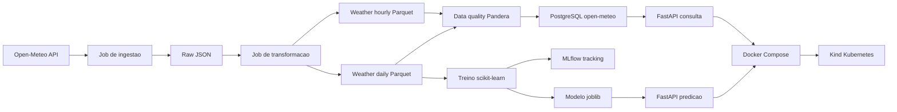

# Arquitetura do Projeto

Este projeto implementa um pipeline end-to-end de Engenharia de Dados com DevOps
e MLOps usando dados climaticos da API publica Open-Meteo.

## Visao Geral



## Componentes

### Ingestao

O job `src.jobs.ingest` le `config/cities.yaml`, chama a API Open-Meteo e salva
um JSON por cidade e data em `data/raw/open_meteo/{city}/{YYYY-MM-DD}.json`.

### Transformacao

O job `src.jobs.transform` normaliza os arquivos raw e gera:

```text
data/processed/weather_hourly.parquet
data/processed/weather_daily.parquet
```

### Data Quality

`src.quality.checks` usa Pandera para validar colunas obrigatorias, tipos,
faixas plausiveis, unicidade e consistencia das agregacoes.

### PostgreSQL

O job `src.jobs.load` carrega os Parquets processados para a database dedicada
`open-meteo`, criando `weather_hourly` e `weather_daily`.

### API

A FastAPI expoe endpoints operacionais, consultas e predicao:

```text
GET /health
GET /metadata
GET /cities
GET /weather/latest
GET /weather/daily
GET /weather/summary
GET /model/info
POST /predict/rain
```

### MLOps

O job `src.ml.train` cria o target `will_rain_tomorrow`, treina um modelo
scikit-learn, registra metricas no MLflow e salva artefatos em `models/`.

### Operacao

O projeto roda via Docker Compose com API, PostgreSQL e MLflow. Tambem possui
manifests em `k8s/` para deploy local em Kind.

## Decisoes

As decisoes tecnicas ficam em `docs/adr/`, cobrindo fonte de dados, arquitetura
raw/processed/PostgreSQL, Pandera, MLflow, database dedicada, serving FastAPI e
Kind.
